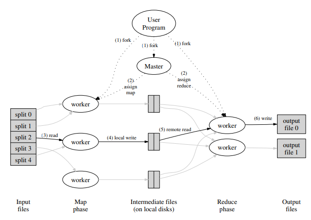
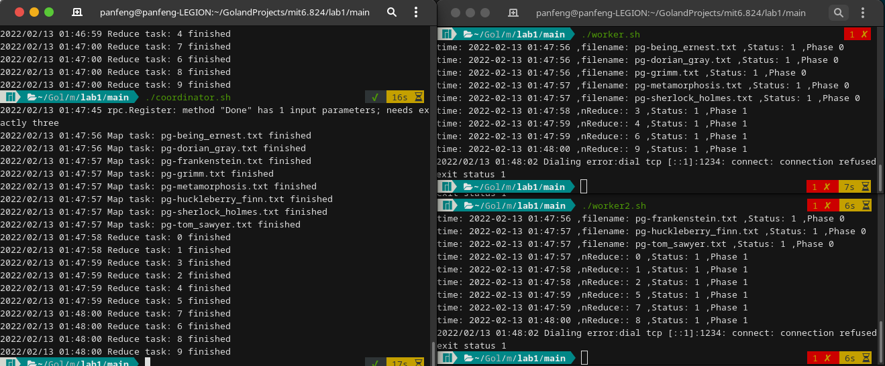

# lab1 MapReduce

## 1.关于MapReduce

> 详细请参考论文: [link](http://static.googleusercontent.com/media/research.google.com/zh-CN//archive/mapreduce-osdi04.pdf)

整体架构如下图：

工作流程：

1. 将原始文件分为M份，从而就产生了M个map task
2. 然后由master分配给worker完成这M个map task，并且使用partition function将输出分为n份（通常通过hash函数），从而产生了N个reduce task
3. master再分配给worker完成这N个reduce task，输出N个output

（由于master这个词不太好，修改为了代码中的coordinator）

## 2.关于代码实现

### 2.1 worker

逻辑比较简单：

1. worker是**stateless**的，coordinator只维护task的状态，而不维护worker的状态，所以可以减少coordinator很大的开销（不需要通过心跳来检测worker的状态）
2. 通过rpc从coordinator**请求task**，然后根据task的类型来做相应的任务（map或reduce）
3. 如果做任务的过程中出错，就通过rpc修改task的状态为error，然后**重做**
4. 做完任务后，再通过rpc修改task的状态，从而**做完**
5. 如果任务超时，每个task都会记录一个开始时间，**超过阈值未完成就重做**（3s）
6. 做完后保存结果，无论是map还是reduce，都需要保存文件，为了保证写入文件的原子性，使用`outil.TempFile`创建临时文件，然后再使用`os.Rename`进行重命名临时文件，从而实现**写入文件的原子操作**

### 2.2 coordinator

* coordinator由于只维护task的状态，所以开销非常小，只有当worker请求task时，coordinator才会遍历task列表，检查task状态（超时），找到能分配的task，然后分配给worker。所以coordinator采用了最**懒惰**的策略，需要开额外的goroutine来检测task的状态，因为就算检测到异常，也没有空闲的worker，不如等worker上门来请求task时再来寻找异常的task分配给他。
* task存在四种状态：
  * TaskErr：任务出错，重做即可
  * TaskReady：任务准备就绪，可以被分配
  * TaskRunning：任务正在运行，如果运行超时，则重新分配
  * TaskDone：任务完成，不再分配
* coordinator主要负责task状态的维护，worker通过rpc来获取task、完成task，因此要保证**读写task状态的原子性**，这里使用**锁**来实现
* coordinator会记录未完成的task数，当map task全做完时，才会转而去做reduce task，reduce task也做完，从而程序结束

## 3.测试结果

- [x] wc test: word count测试
- [x] indexer test: indexer测试
- [x] map parallelism test: map并发测试
- [x] reduce parallelism test: reduce并发测试
- [ ] crash test: crash 测试

只有crash测试没有通过，这是因为我的worker是stateless的，所以coordinator不会监测worker的状态，当worker crash掉时，coordinator不会对其进行重启，所以这一项不能通过。

当然可以通过添加心跳监测来完成这一项测试，但是感觉没必要，每种架构有每种架构的优点，这样效率高，挺好的！

## 4.运行展示

开一个coordinator，开两个worker，然后两个worker就能和谐的一起工作了:happy:

